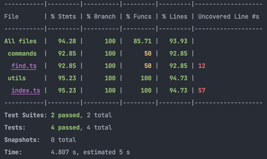

# foursquare-finder

## Description

This repo contains a minimalistic Node.js CLI app to quickly find Foursquare venues near a given location.

## Get Started

-   Clone this repository:

    ```bash
    git clone https://github.com/ajejoseph22/foursquare-finder.git
    cd foursquare-finder
    ```

-   Install dependencies:

    ```bash
      yarn install
    ```

-   Configure the environment variables in the `.env` file

    ```bash
      cp .env.sample .env
    ```

    Fill in the values in the .env file. You can get the values from https://developer.foursquare.com/

-   To run the app in development mode
    ```bash
      yarn dev find <uk postcode>
    ```
-   To run the app in production mode
    ```bash
    yarn link
    foursquare find <uk postcode>
    ```
-   To run the tests with coverage
    ```bash
      yarn test
    ```
    

**PS: results take the format <uk postcode>.csv are saved in the `results` folder in the root directory from where the app is run**
